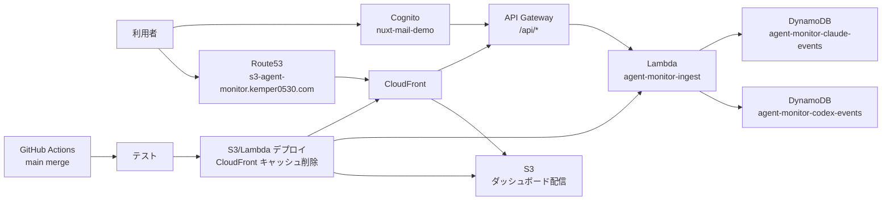

# agent-monitor

`agent-monitor` は、Codex や Claude Code などの AI コーディングエージェントの進捗、異常、質問、ツール利用、トークン、概算コストを確認するためのダッシュボードです。

ローカルでは軽量な Go サーバーと JSONL で動作し、AWS では CloudFront、S3、API Gateway、Lambda、DynamoDB、Cognito を利用して公開できます。

## 本番URL

```text
https://s3-agent-monitor.kemper0530.com
```

ダッシュボードは Cognito Hosted UI でログインしたユーザーだけが利用できます。

## AWS構成図

draw.io 用の構成図ファイルは [docs/aws-architecture.drawio](docs/aws-architecture.drawio) にあります。



## ローカル起動

1. 監視を有効にします。

```bash
export AGENT_MONITOR_ENABLED=true
```

2. ローカルで Codex 用の監視設定を有効にします。

```bash
export AGENT_MONITOR_AGENT=codex
touch .agent-monitor
```

3. CLI からイベントを記録します。

```bash
go run ./cmd/agent-monitor --type task --status running --title "MVPを実装" --agent codex --tokens 1200 --tool-calls 4
go run ./cmd/agent-monitor --type question --status blocked --title "AWSアカウントIDの確認が必要"
```

4. ダッシュボードを起動します。

```bash
make run
```

ブラウザで `http://localhost:8080` を開きます。

## 監視の有効化ルール

監視はデフォルトで無効です。有効化の優先順位は次の通りです。

1. `AGENT_MONITOR_ENABLED=true` または `false`
2. 環境変数がない場合は `.agent-monitor` マーカーファイル
3. どちらもない場合は無効

監視が無効な場合、CLI は終了コード `0` で終了し、ファイル書き込みや HTTP 呼び出しを行いません。

## アーキテクチャ

ローカル構成:

```text
Codex / Claude Code -> agent-monitor CLI -> JSONL -> Go Server -> Web Dashboard
```

AWS構成:

```text
Route53 -> CloudFront -> S3 Dashboard
Route53 -> CloudFront -> API Gateway -> Lambda -> DynamoDB
```

Go 側はクリーンアーキテクチャを意識して、責務を小さく分けています。

- `internal/model`: イベントとスナップショットのエンティティ
- `internal/store`: JSONL 永続化
- `internal/api`: HTTP ハンドラ
- `internal/config`: 監視有効化と実行時設定

## AWS認証

ダッシュボードは既存の Cognito ユーザープールを利用します。

- ユーザープール名: `nuxt-mail-demo`
- ユーザープールID: `ap-northeast-1_7da4pYlPc`
- Hosted UI: `https://agent-monitor-kemper0530.auth.ap-northeast-1.amazoncognito.com`
- API Gateway: `/api/*` に Cognito JWT が必要

静的HTMLは CloudFront から配信されますが、ダッシュボードの JavaScript は未ログイン時に Cognito Hosted UI へリダイレクトします。API データは Cognito Authorizer により保護されます。

## DynamoDB分離

Codex と Claude のデータは別テーブルに保存します。

- Codex: `agent-monitor-codex-events`
- Claude: `agent-monitor-claude-events`

Lambda の有効化フラグは次の2つです。

- `CODEX_MONITOR_ENABLED=true|false`
- `CLAUDE_MONITOR_ENABLED=true|false`

API 呼び出し時は `agent=codex` または `agent=claude` を指定できます。

```text
GET /api/snapshot?agent=codex
GET /api/snapshot?agent=claude
```

## API認証と呼び出し方法

本番APIは API Gateway の Cognito Authorizer で保護されています。`Authorization` ヘッダーに Cognito の ID トークンを `Bearer` 形式で渡します。

ダッシュボードから利用する場合は、Cognito Hosted UI でログインすると `web/app.ts` が ID トークンを取得し、APIリクエストへ自動付与します。

Codexから自動送信する場合は、`AGENTS.md` のルールに従って `cmd/agent-monitor` が実行されます。`AGENT_MONITOR_API_URL` と `AGENT_MONITOR_ID_TOKEN` が設定されていればAWS APIへ送信し、未設定ならローカルJSONLへ保存します。

```bash
export AGENT_MONITOR_ENABLED=true
export AGENT_MONITOR_AGENT=codex
export AGENT_MONITOR_API_URL="https://s3-agent-monitor.kemper0530.com"
export AGENT_MONITOR_ID_TOKEN="<Cognitoのid_token>"

go run ./cmd/agent-monitor --type task --status running --title "Codex作業開始" --agent codex
```

ローカルでは同じ内容を `.agent-monitor.env` に置くと、`cmd/agent-monitor` が起動時に自動で読み込みます。

手元から `curl` する場合は、ブラウザでログイン後のURLフラグメントに含まれる `id_token` を使います。

スナップショット取得:

```bash
curl -H "Authorization: Bearer ${AGENT_MONITOR_ID_TOKEN}" \
  "https://s3-agent-monitor.kemper0530.com/api/snapshot?agent=codex"
```

## テスト

```bash
make test
```

`make test` は `cmd` と `internal` を対象にします。`infra/node_modules` 配下のファイルを Go パッケージとして扱わないためです。

## AWS CDK

依存関係をインストールして、CDK を合成します。

```bash
cd infra
npm install
npm run synth
```

AWS に初回デプロイします。

```bash
cd infra
npm run deploy
```

初回 CDK デプロイ後は、S3 と Lambda だけを更新します。

```bash
cd infra
npm run deploy:app
```

`deploy:app` は次を実行します。

1. Lambda の ZIP を作成
2. Lambda コードを更新
3. `web/` を S3 に同期
4. CloudFront のキャッシュを削除

## LocalStack

LocalStack にも同じ CDK スタックをデプロイできます。

```bash
make localstack-up
cd infra
npm install
npm install -g aws-cdk-local
npm run deploy:local
```

CloudFront の対応範囲は LocalStack のエディションとバージョンに依存します。

## GitHub Actions

`.github/workflows/deploy.yml` は Pull Request でテストと CDK 型チェックを実行します。

`main` にマージされた場合、テスト成功後に AWS へデプロイします。

- `AgentMonitorStack` が未作成の場合: `npm run deploy`
- `AgentMonitorStack` が存在する場合: `npm run deploy:app`

必要な GitHub 設定:

- Secret: `AWS_ROLE_TO_ASSUME`
- Variable: `AWS_REGION` 例: `ap-northeast-1`

`AWS_ROLE_TO_ASSUME` が未設定の場合、テスト後にデプロイジョブはスキップされます。
